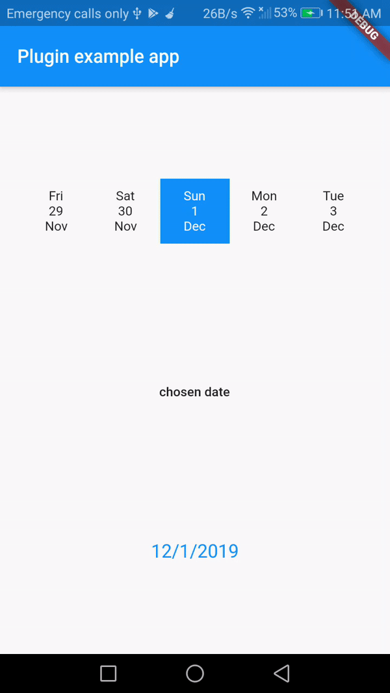

# Custom_Horizontal_calendar

A new flutter plugin project aims to implement horizontal Calender.

# Features #
- Seperate Date picker Component.
- CustomShape and style  for Selected Item.
- CustomShape and style  for unSelected Item.
- Swipe behavior,not list.

## Getting Started

This project is a starting point for a Flutter
[plug-in package](https://flutter.dev/developing-packages/),
a specialized package that includes platform-specific implementation code for
Android and/or iOS.

For help getting started with Flutter, view our 
[online documentation](https://flutter.dev/docs), which offers tutorials, 
samples, guidance on mobile development, and a full API reference.
## depandancy packeges
- intl: 0.15.8
- swipedetector: 1.2.0
## App Demo



## Example
This plugin allow you to do custom styles and shapes for Selected and UnSelected dates
```dart
           CustomHorizontalCalendar(
                onDateChoosen: (date){setState(() {
                 chosen=date; 
                });},
                inintialDate: DateTime.now(),
                height: 60,
                builder: (context, i, d,width) {
                  if (i != 2)
                    return DateRow(d ,width: width,
                   );
                  else
                    return DateRow(
                      d,
                      background: Colors.blue,
                      selectedDayStyle: TextStyle(color: Colors.white),
                      selectedDayOfWeekStyle: TextStyle(color: Colors.white),
                      selectedMonthStyle: TextStyle(color: Colors.white),width: width,
                    );
                },
              )
```